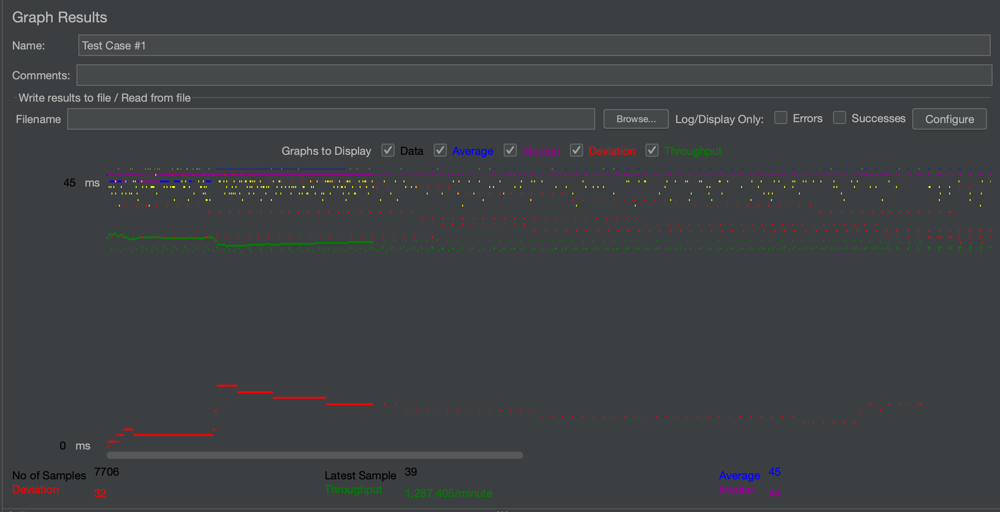
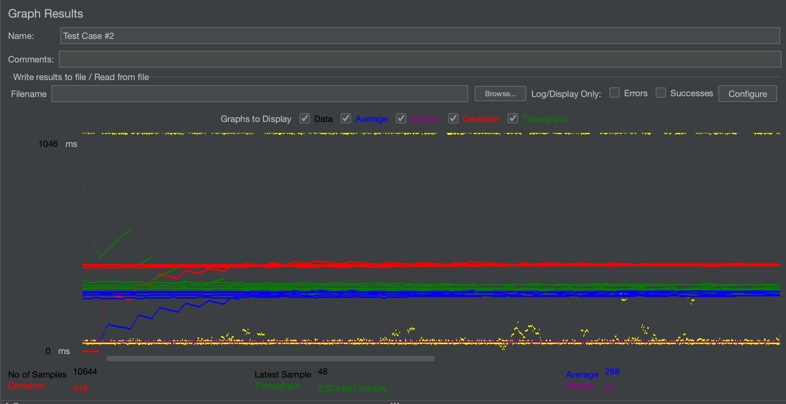
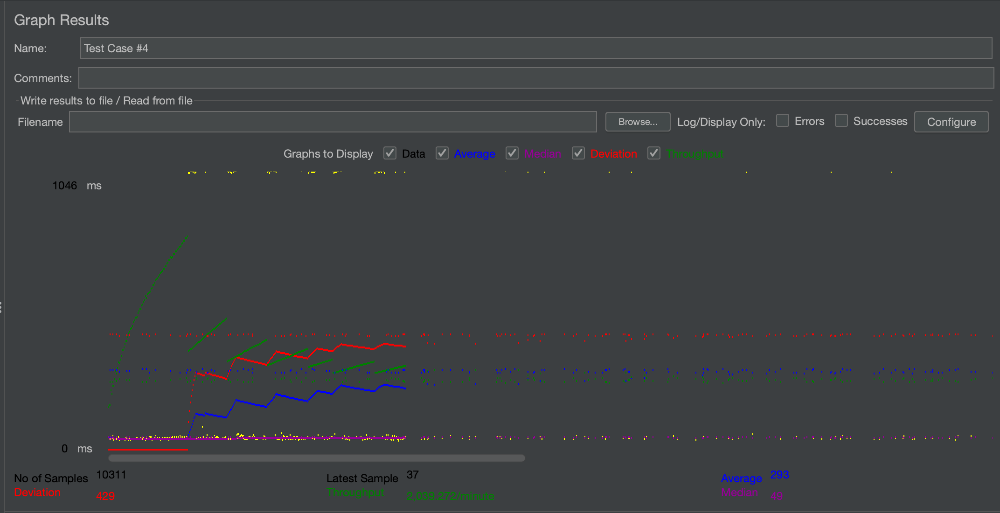
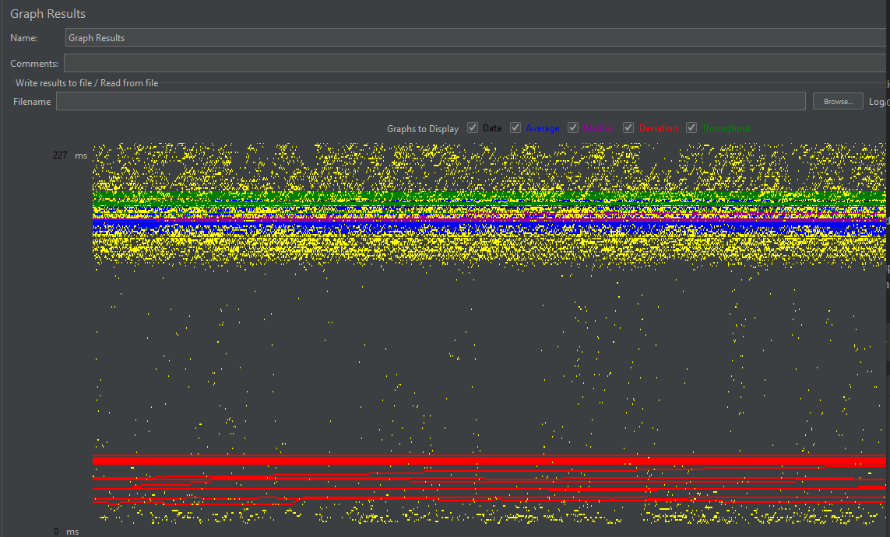
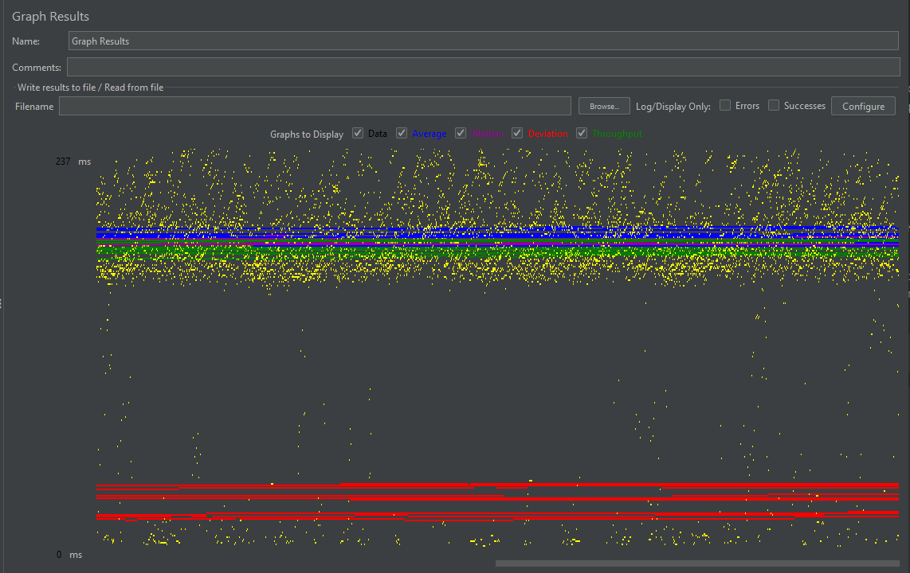

- # General
    - #### Team#: 37

    - #### Names:
      - Yaseen Khan(yaseenk@uci.edu)
      - Jadon Kwan(jadonk@uci.edu)

    - #### Project 5 Video Demo Link:
    - https://drive.google.com/file/d/1p6V2Ix3EC5MszBOfSZsux6rmG2GLTcid/view?usp=sharing

    - #### Instruction of deployment:
      - ##### Database Setup:
        - Download the latest version of MySQL if you don't have it 
        - Login to mysql as the root user: ```local> mysql -u root -p```
        - Create user CS122B and grant privileges
          ```
          mysql> CREATE USER 'CS122B'@'localhost' IDENTIFIED BY 'FabFlix';
          mysql> GRANT ALL PRIVILEGES ON * . * TO 'CS122B'@'localhost';
          mysql> quit;
          ```
        - Create the moviedb database
        ```
        local> mysql -u CS122B -p
        mysql> CREATE DATABASE IF NOT EXISTS moviedb;
        mysql> USE moviedb;
        mysql> quit;
        ```
        - Create the moviedb tables using the create_table.sql file: ```local> mysql -u CS122B -p < create_table.sql```
        - Populate the database data using the movie-data.sql file: ```local> mysql -u CS122B -p --database=moviedb < PATH/movie-data.sql```Populate the database data using the movie-data.sql file: ```local> mysql -u CS122B -p --database=moviedb < PATH/movie-data.sql```
      - ##### Option 1: Deploy from AWS
        - SSH into your AWS instance. EX: ```ssh -i My.pem ubuntu@ec2-myipaddress.us-west-2.compute.amazonaws.com```
        - Clone the github repo using ```git clone https://github.com/uci-jherold2-teaching/cs122b-fall-team-37.git```
        - If you don't have the moviedb database setup, follow the **Database Setup** instructions
        - If using a different database account, change the username and password in ```web/META_INF/context.xml```
        - Run ```mvn package``` to build the war file.
        - Copy the war file: ```sudo cp ./target/*.war /var/lib/tomcat9/webapps/```
        - Refresh your tomcat manager and deploy the app.
        - Head to the web page of your AWS instance.
      - ##### Option 2: Local(Intellij)
        - Clone the github repo using ```git clone https://github.com/uci-jherold2-teaching/cs122b-fall-team-37.git```
        - Open the Project in Intellij
        - If you don't have the moviedb database setup, follow the **Database Setup** instructions
        - If using a different database account, change the username and password in ```web/META_INF/context.xml```
        - Build project using maven.
        - Set up tomcat to use your war file (IntelliJ has configuration with Tomcat).
        - Open your localhost to the correct port.

    - #### Collaborations and Work Distribution:
      - ##### Yaseen Khan
      - Set up Connection Pooling
      - Performed Single-Instance JMeter tests
      - Wrote log_processing.py script
      - ##### Jadon Kwan
      - Set Up Master/Slave instances
      - Set Up Load Balancer
      - Performed Scaled JMeter tests


- # Connection Pooling
    - #### Include the filename/path of all code/configuration files in GitHub of using JDBC Connection Pooling.
      - src/main/java/FullTextSearchServlet.java
      - src/main/java/SearchMovieServlet.java
      - src/main/java/AutocompleteSearchServlet.java
      - WebContent/META-INF/context.xml

    - #### Explain how Connection Pooling is utilized in the Fabflix code.
    - Connection Pooling is utilized in the Search servlets for the JMeter tests. The connection pool configurations are in the context.xml file. The max number of pool connections is 100. The max number of idle connections is 30. The maximum timeout period for a connection is 10000 ms. Additionally, the Prepared Statements for each servlet is cached so more than one JDBC connection can utilize these statements. Caching the Prepared Statements is needed since Prepared Statements are usually associated with one Connection. Once all the Prepared Statements are executed, the database connection closes.

    - #### Explain how Connection Pooling works with two backend SQL.
    - Since there are 2 backend instances, there will also be 2 database instances when the connection pools are created. When both the master and slave connections are opened, and a new connection is created in slave or master, the connection pool will direct to where the new connection is created. These connections are added to the connection pool for reusability but are separated by the database.   


- # Master/Slave
    - #### Include the filename/path of all code/configuration files in GitHub of routing queries to Master/Slave SQL.
    WebContent/META-INF/context.xml

    - #### How read/write requests were routed to Master/Slave SQL?
    For the Slave Instance, if it is given a write request, it uses a different connection and connects to the Master database rather than the localhost (its own). So even if it still receives write requests which is intended, it will write to the other database using the different connection.

- # JMeter TS/TJ Time Logs
    - #### Instructions of how to use the `log_processing.*` script to process the JMeter logs.
    - The log processing script is written using Python3
    - The JMeter logs are stored as text files. The log processing script only supports text files
    - To run log_processing.py, you need 2 parameters: directory/filename.txt and a positive integer representing the test case
     ```
        python3 log_processing.py <directory_name>/logfile.txt <integer case number>
     ```
    - If the log files are in the same directory as log_processing.py script, then the directory name does not need to be specified
    ```
        python3 log_processing.py logfile.txt <integer case number>
    ```


- # JMeter TS/TJ Time Measurement Report

| **Single-instance Version Test Plan**          | **Graph Results Screenshot**                                    | **Average Query Time(ms)** | **Average Search Servlet Time(ms)** | **Average JDBC Time(ms)** | **Analysis**                                                                                                                                                                                                                                                                                                                                                                                               |
|------------------------------------------------|-----------------------------------------------------------------|----------------------------|-------------------------------------|---------------------------|------------------------------------------------------------------------------------------------------------------------------------------------------------------------------------------------------------------------------------------------------------------------------------------------------------------------------------------------------------------------------------------------------------|
| Case 1: HTTP/1 thread                          |  | 45                         | ??                                  | ??                        | Since there is only 1 thread, the average query time was much faster than the other cases since there were a lot less threads and only 1 thread is making API calls.                                                                                                                                                                                                                                       |
| Case 2: HTTP/10 threads                        |  | 288                        | ??                                  | ??                        | The second case is faster than the HTTPS case but slower than the non-pooling connection case. This case is faster than HTTPS since HTTPS is more secure and requires more overhead. This case is slower than the non-connection pooling since there is slightly more overhead with threads sharing connections                                                                                            |
| Case 3: HTTPS/10 threads                       |  | 323                        | ??                                  | ??                        | This case is the slowest out of all the other cases. This is due to HTTPS being more secure which requires more overhead. This case also uses connection pooling which is a little slower than non-connection pooling since multiple threads need to reuse the connections instead of each thread having their own connections. However, connection pooling is more beneficial when there is more traffic. |
| Case 4: HTTP/10 threads/No connection pooling  |  | 239                        | ??                                  | ??                        | The non-connection pooling is faster than the HTTP connection pooling and HTTPS connection pooling cases. This is due to each thread having their own connections instead of reusing connections. However, as more threads are added, connection pooling becomes more efficient as it handles more traffic better.                                                                                         |

| **Scaled Version Test Plan**                   | **Graph Results Screenshot**                                    | **Average Query Time(ms)** | **Average Search Servlet Time(ms)** | **Average JDBC Time(ms)** | **Analysis**                                                                                                                                                                                           |
|------------------------------------------------|-----------------------------------------------------------------|----------------------------|-------------------------------------|---------------------------|--------------------------------------------------------------------------------------------------------------------------------------------------------------------------------------------------------|
| Case 1: HTTP/1 thread                          |  | 181                        | ??                                  | ??                        | With only 1 thread, the timing was the same as 10 threads with no pooling. This is likely because connection pooling only helps when there's a lot of traffic.                                         |
| Case 2: HTTP/10 threads                        |  | 178                        | ??                                  | ??                        | With pooling it was slightly faster and despite there being 10 threads.                                                                                                                                |
| Case 3: HTTP/10 threads/No connection pooling  |  | 181                        | ??                                  | ??                        | With 10 threads, it was not that much slower than 1 thread, but it was still not as fast as with the connection pooling. So the connection pooling appears to help only when there's a lot of traffic. |

